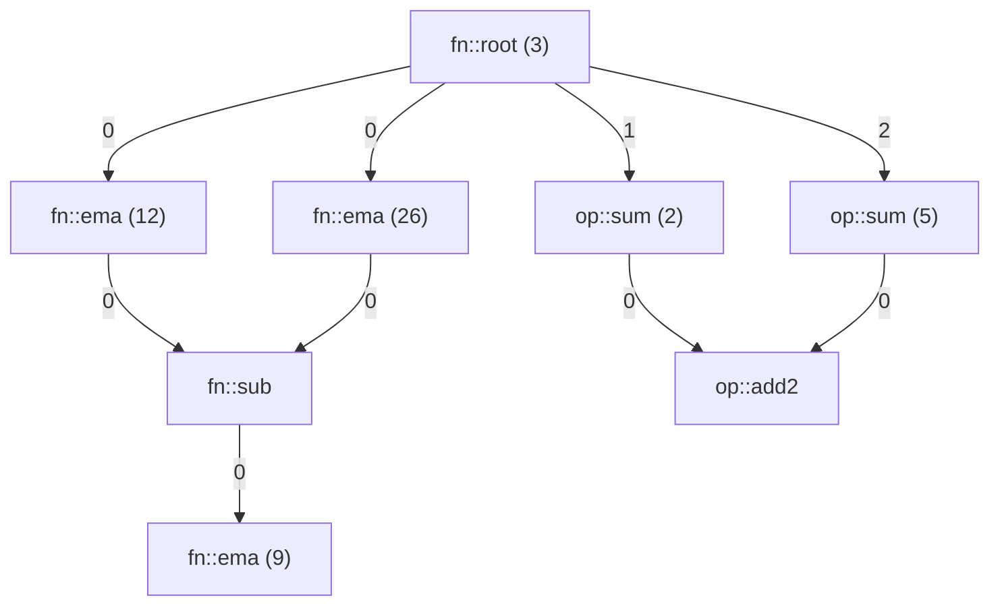

# Pipeline overview

| Stage     | Role        | Product                                   | Notes                                                               |
|-----------|-------------|-------------------------------------------|---------------------------------------------------------------------|
| 0 (Src)   | DataSource  | Raw data                                  | External file, DB, message queue, etc.                              |
| 1 (Src)   | Parse       | (timestamp, key/group, data)              | Converts raw data to structured messages                            |
| 2 (Pre)   | Select      | (timestamp_as_datatype, key/group, data)  | Optional: filters/selects relevant messages                         |
| 3 (Pre)   | Align       | (timestamp_as_datatype, key/group, data)  | Aligns events to a common timestamp or window, emits aligned events |
| 4 (Pre)   | Combine     | (timestamp_as_datatype, data)             | Combines across key/group to produce a single stream                |
| 5 (Exec)  | Algo Exec   | (timestamp_as_datatype, data)             | Executes algorithms defined as DAGs                                 |
| 6 (Out)   | Observer    | (timestamp, Side effects)                 | Observes output, can be used for monitoring or further processing   |

## Expected Interface

algo0 :



```cpp
// Initialise an aggregator
agg_builder<double> builder{};
builder.input_size(3)
  .window<win::tumbling>(10) // win::tumbling<double> is instantiated
  .add<agg::ohlc>({0})
  .add<some_other_agg<double, some_type>>({1, 2}, some, ctor,args); // selected cols, args passed to ctor
auto agg = builder.build(); // build returns an agg_exec<T> object

// Create DAG algo
using base = std::shared_ptr<fn_base<double>>;
graph<base> algo0_dag{};
auto root      = algo0_dag.root<fn::root>(3);                // declare root, fn::root<double> is instantiated
auto ma_fast   = algo0_dag.add<fn::ema<double>>({root}, 12); // can use concrete type as well
auto ma_slow   = algo0_dag.add<fn::ema>(root, 26);           // single pred dont need init list
auto diff      = algo0_dag.add<fn::sub>({ma_fast, ma_slow}); // default port 0
auto ma_diff   = algo0_dag.add<fn::ema>(diff | 0_p, 9);      // specify port
auto sum_left  = algo0_dag.add<op::sum>(root | 1_p, 2);
auto sum_right = algo0_dag.add<sum_type>(root | 2_p, 5);
auto add2      = algo0_dag.add<add2_type>({sum_left | 0_p, sum_right | 0_p});

fn_dag_exec<double> algo0(algo0_dag, {diff, ma_diff, add2});

// op dag has same interface

auto pipeline = make_pipeline()
    .source<market_data_source>(config)
    .parse<csv_parser>(delimiter, columns)
    .select<symbol_filter>({"AAPL", "MSFT"})
    .align<time_window_aligner>(1min)
    // combine interface tbd
    .combine(std::make_shared<weighted_average>(weights, ncols), avg_cols) // avg_col1, avg_col2...
    .combine(std::make_shared<max>(), max_return_cols) // appended: avg_col1, avg_col2..., avg_coln, max_col1, max_col2...
    .exec(agg)
    .exec(algo0)
    .exec(algo1)
    .observe<console_output>()
    .build();
```

## Notes on data semantics/assumptions

1. Data is in-order. -> no need for buffering and watermarking
2. Pipeline itself does not scale, its just sync fn calls from input to output for low latency. -> no need for partial aggr and other fancy distributed algos

## Notes on Align

1. Timestamp alignment:
    - Assign to latest timestamp: Use the most recent timestamp seen across all keys/groups.
    - Assign to latest window: Snap to the latest fixed time window (e.g., 1s, 1min).
    - Assign to current walltime on emission: Use the system clock at the moment of emission.
2. Emission triggers:
   - Executor request/flush: Executor requests aligned data, triggering emission.
   - Timer-based: Emit at regular intervals (e.g., every second).
   - Event-Driven (LVCF): Emit when new data arrives, carrying forward the last value for missing keys/groups.
   - Time binning: Emit when one or all keys/groups have satisfied a window condition (e.g., all have reported for the current window).

## Notes on Combine

1. After aligner emitting data, the combiner needs to aggregate the data across keys/groups.

| key/group | timestamp | col0 | col1 | ... |
|-----------|-----------|------|------|-----|
| k0        | t0        | val  | val  | ... |
| k1        | t0        | val  | val  | ... |
| k2        | t0        | val  | val  | ... |

becomes:

| timestamp | colα | colβ | ... |
|-----------|------|------|-----|
| t0        | val  | val  | ... |

## Notes on Transform

1. transforms are chained linearly, with each transform taking the output of the previous one as input.
2. transforms can be 1:1 or N:1 (aggregation)
3. aggregation = window emitter + aggregate function
4. transform result can be observable

## Notes on Graph Exec

None.

## Notes on Observability

TBD.

## Error handling

TBD.

## Misc

1. We do not consider any backpressure. Need more benchmarks. Currently 30ns overhead per op node.
